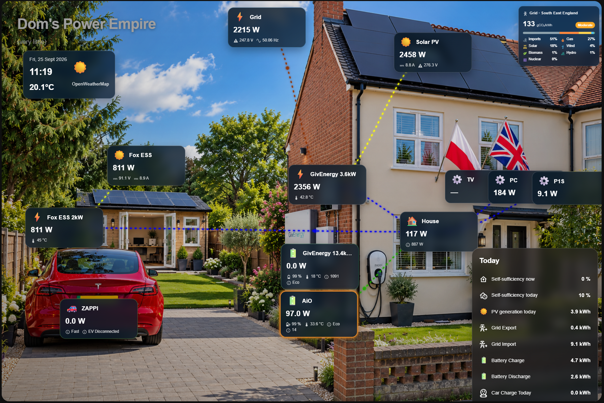

# ⚡ Home Power Flow Card

[](https://github.com/hacs/integration)
[](https://github.com/mimikm/Home-Power-Flow-Card/releases)
[](https://github.com/mimikm/Home-Power-Flow-Card/actions/workflows/validate.yml)

An animated, real-time energy flow card for Home Assistant dashboards, built by **Dom** ([@mimikm](https://github.com/mimikm)).

Show your whole home energy system (solar, batteries, grid, EV chargers, even multi-inverter setups) as a living picture of your home, with power flowing between devices exactly as your sensors report it.



---

## 🧪 Public test release

The card is feature-complete for most setups and actively developed. It's my **first open-source project**, and it keeps improving thanks to feedback from testers.

**Back up your dashboard before installing** (or export your existing card config, see [Backup & Restore](#-backup--restore)).

Found a problem? [Open an issue](https://github.com/mimikm/Home-Power-Flow-Card/issues) and include:
- Home Assistant version
- Card version (shown in the browser console on load)
- Your card configuration (YAML or an exported config file)
- The affected entities and what you expected to see

Don't worry if your issue comes in as ticket #195,941. I'll get through them all. Eventually. Possibly with coffee. ☕

---

## ☕ Support the project

If you enjoy the card and want to support its development:

**[☕ Buy me a coffee](https://buymeacoffee.com/mimikm)**

---

## 📦 Installation

### HACS (recommended)

[](https://my.home-assistant.io/redirect/hacs_repository/?owner=mimikm&repository=Home-Power-Flow-Card&category=plugin)

Or manually in HACS:
1. Open **HACS** in Home Assistant
2. Open the **⋮** menu → **Custom repositories**
3. Add `https://github.com/mimikm/Home-Power-Flow-Card` with the type **Dashboard**
4. Search for **Home Power Flow Card** and download it
5. Reload your browser
6. Add the card to a dashboard (search for "Home Power Flow Card")

### Manual

1. Download `home-power-flow-card.js` and the background images from the [latest release](https://github.com/mimikm/Home-Power-Flow-Card/releases)
2. Copy them into `/config/www/`
3. Add a dashboard resource: **Settings → Dashboards → ⋮ → Resources** → `/local/home-power-flow-card.js`, type **JavaScript module**
4. Add the card to a dashboard

> **Not seeing an update?** Browsers cache card files aggressively. Hard-refresh (Ctrl/Cmd+Shift+R), and on phones fully close and reopen the Home Assistant app.

---

## ✨ Features

### 🌊 Animated energy flows
- Live animated flow lines between every device, with a moving, softly pulsing dot showing the direction of power
- Dots move **faster on high-power connections** and slower on light ones
- Evenly spaced flow lines, whatever the distance between devices
- A configurable **noise threshold** keeps idle connections quiet

### 🔌 Any setup, including multi-inverter
- Device types: ☀️ Solar, ⚡ Inverter, 🔋 Battery, 🧠 Gateway / distribution board, 🏠 House, 🌐 Grid, 🚗 EV charger and ⚙️ Extra load, as many of each as you need
- **"Connects to"** links let you describe your real wiring (e.g. Solar 2 → Inverter 2)
- A **Gateway** device can act as the meeting point between several inverters
- Left on **Automatic**, everything still connects sensibly out of the box
- Optional **manual connections** for full control over what flows where

### 🎨 Per-device customisation
- Own name, power entity and **flow colour** for every device
- **Invert flow** per device, for sensors that report power the other way round
- Up to **5 extra entities** per device (SoC, voltage, temperature...) with their own icons, shown in small text under the power value
- **Battery glow**: batteries pulse green when charging and amber when discharging (can be turned off per battery)

### 🖱️ Flexible layout
- **Drag and drop** devices, the title, the weather box, the Today panel and the grid mix box to exactly where you want them
- **Custom backgrounds**: separate day and night images, switched automatically by the sun
- **Title and subtitle** with your own text and colour, or leave them blank
- **Sizing controls** for the title, device boxes, weather box, Today panel and grid mix box

### 📱 Fits every screen
- The whole card scales to the available width, so it looks the same on a monitor, a tablet or a phone
- It never grows taller than your screen
- Text is boosted automatically on phones so it stays readable
- Full support for Home Assistant's **Sections** dashboards
- Tested on desktop browsers and the iOS app

### 🌤️ Weather, stats and grid
- **Weather & clock** box from any weather entity (12 or 24 hour)
- **Today panel** with up to 20 statistics (solar yield, grid import/export, anything with a number), each with its own icon, updating live
- **Self-sufficiency** (optional): the share of your home's electricity that didn't come from the grid, right now (calculated automatically from your Grid and House devices) and for today (from your daily energy sensors)
- **UK grid mix** box (optional): live carbon intensity with a colour-coded rating, plus the current generation mix by source, for your region or all of Great Britain

### ⚙️ Fully visual editor
- Everything is configurable without YAML, using Home Assistant's own entity, icon and colour pickers
- Collapsible, **drag-to-reorder** devices and statistics
- **Duplicate** any device with one click, handy for multi-inverter or multi-string setups
- A **live direction readout** under each device's Invert flow toggle (e.g. `▶ Solar PV → Inverter · 450 W`), so you can check flow directions before saving
- A live preview that always shows the whole card
- Click any device on the card to open its Home Assistant details

### 💾 Backup & Restore
Export your whole card configuration as a JSON file with one click, and import it again later. Handy before big changes, or to share a working setup.

---

## ⚡ Flow threshold

A device's power must reach the threshold before its flow line appears, so sensor noise doesn't cause flickering. Default: **1 W**, adjustable in the editor.

Each line is judged by its own device: a device reading 0 W stays quiet even if whatever it's connected to is busy.

---

## 🏡 Self-sufficiency

Self-sufficiency is the share of your home's electricity that **didn't** come from the grid:

> self-sufficiency = 1 − grid import ÷ home consumption

- **Now** uses the live power of your **Grid** and **House** devices. Exporting counts as 100%. If your grid sensor reports import as a negative number, tick **Invert flow** on the Grid device and the calculation reads it correctly too.
- **Today** uses two daily energy sensors (kWh): grid import today and home consumption today.

Both rows appear at the top of the Today panel. Turn them on in the editor's **Self-sufficiency** section.

---

## 🔌 Multi-inverter setups

With a single inverter there is nothing to configure.

With two or more inverters:
1. **Nothing wired manually?** Devices attach to the first inverter, and extra inverters attach to a Gateway device if you have one. Nothing is left disconnected.
2. **Want it to match your real wiring?** Add a **Gateway** device and set each device's **Connects to** field.
3. **Direction backwards?** Use that device's **Invert flow** toggle. The live readout under it shows the current direction straight away.

> Devices set to Automatic connect to the *first* inverter in the list, so reordering inverters changes which one is the main hub.

---

## 🛠 Example configuration

Everything below can also be set up in the visual editor.

```yaml
type: custom:home-power-flow-card
title: Energy Flow
subtitle: Live power
devices:
  - type: solar
    name: Solar PV
    power_entity: sensor.solar_power
    connects_to: inv1
  - type: inverter
    name: Inverter
    id: inv1
  - type: battery
    name: Battery
    power_entity: sensor.battery_power
    connects_to: inv1
    extra_entities:
      - entity: sensor.battery_soc
        icon: mdi:battery-charging
  - type: grid
    name: Grid
    power_entity: sensor.grid_power
  - type: house
    name: House
    power_entity: sensor.house_power
  - type: ev
    name: EV Charger
    power_entity: sensor.ev_power
statistics:
  entities:
    - name: Solar today
      entity: sensor.solar_energy_today
      icon: mdi:solar-power
grid_mix_enabled: true
grid_mix_postcode: SW1A
```

Each device gets a stable internal `id` automatically. `connects_to` refers to that id rather than a position in the list, so reordering or deleting devices never rewires a connection by mistake.

---

## 📋 Configuration options

### Card

| Option | Default | Description |
|---|---|---|
| `title` | `Energy Flow` | Card title. Set to `""` for no title |
| `subtitle` | — | Optional second line under the title |
| `title_color` | `#ffffff` | Colour of the title and subtitle |
| `time_format` | `24h` | `24h` or `12h` for the clock |
| `weather_entity` | — | Weather entity for the weather box |
| `sun_entity` | `sun.sun` | Switches between the day and night backgrounds |
| `background` | built-in | Day background image URL |
| `background_night` | built-in | Night background image URL |
| `flow_threshold_watts` | `1` | Minimum power (W) before a flow line shows |
| `flow_speed` | `8` | Base animation duration in seconds (at 1 kW) |
| `grid_mix_enabled` | `false` | Show the UK grid mix box |
| `grid_mix_postcode` | — | Outward postcode for regional data (e.g. `SW1A`); blank = all of GB |
| `self_sufficiency_live` | `false` | Show live self-sufficiency (needs a Grid and a House device) |
| `self_sufficiency_today` | `false` | Show today's self-sufficiency |
| `self_sufficiency_import_entity` | — | Grid import today (kWh) sensor |
| `self_sufficiency_consumption_entity` | — | Home consumption today (kWh) sensor |

### Sizing

| Option | Default | Description |
|---|---|---|
| `title_scale` | `1` | Title and subtitle size |
| `device_scale` | `1` | Device box size |
| `weather_scale` | `1` | Weather box size |
| `stats_scale` | `0.8` | Today panel size (also shrinks automatically if too tall) |
| `grid_mix_scale` | `1` | Grid mix box size |
| `mobile_scale` | `1.4` | Extra size for boxes on phones |
| `max_width` | `0` | Maximum card width in px (`0` = fill the available width) |

### Devices

| Option | Description |
|---|---|
| `type` | `solar`, `inverter`, `battery`, `gateway`, `house`, `grid`, `ev` or `load` |
| `name` | Display name |
| `power_entity` | Power sensor (W) |
| `connects_to` | `id` of the device it's wired to (blank = Automatic) |
| `flow_color` | Flow line colour, e.g. `#ffd54f` |
| `invert_flow` | `true` to reverse the flow direction |
| `battery_glow` | Batteries only: `false` to turn off the charge/discharge glow |
| `extra_entities` | Up to 5 extra readings, each with `entity` and `icon` |

Positions and sizes are easiest to set by dragging in the editor's **Visual layout**.

---

## 🗺️ Roadmap

Ideas and feedback are welcome, so [open an issue](https://github.com/mimikm/Home-Power-Flow-Card/issues) if there's something you'd like to see.

**Stability & polish**
- Editor warnings for misconfigured devices and broken "Connects to" links
- Respect the system "reduce motion" setting for flow dots
- Separate phone layout (different positions on small screens)

**Features**
- Automatic kW formatting for large values (e.g. `3.2 kW` instead of `3200 W`)
- Configurable tap actions per device (more-info, navigate, toggle)
- Battery time remaining (to full / to reserve). *Waiting on feedback, let me know if you'd use it!*
- Light theme support

**Project**
- Translations of the editor

---

## 🤝 Contributing

Suggestions, bug reports and improvements are very welcome, so please [open an issue](https://github.com/mimikm/Home-Power-Flow-Card/issues). Testing on multi-inverter, gateway or other unusual setups is especially valuable.

---

## ❤️ Thanks

This project started as a personal dashboard improvement and is growing into a community project. Thank you to everyone testing it, suggesting improvements and helping make it better.

Grid mix data: [Carbon Intensity API](https://carbonintensity.org.uk/) by the National Energy System Operator (NESO).

---

## 📄 License

MIT © [Dom (mimikm)](https://github.com/mimikm)
